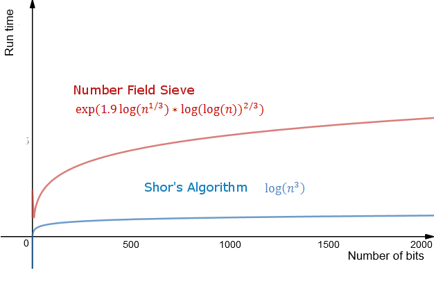
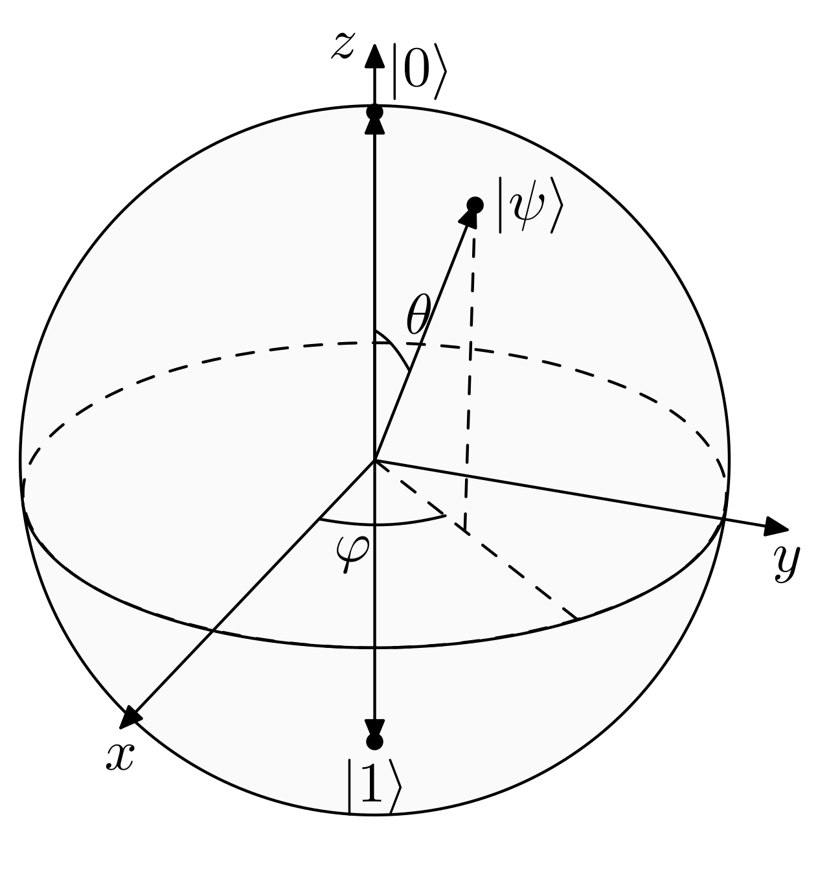
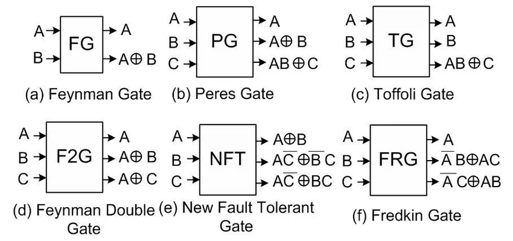
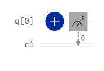
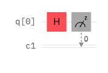
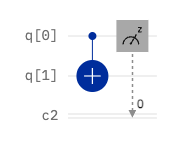

<!-- _class: cover -->
<!-- _paginate: false -->
<!-- _footer: '' -->

# Quantum<br>computing 101

## Mario Bifulco

PhD student @ University of Turin

---

# $whoami

Mario Bifulco - PhD student @ University of Turin

Research focus:

- Quantum Machine Learning
- Quantum Optimization
- Quantum High Performance Computing

---

<!-- _class: divider -->

# What is a<br>Quantum Computer?

---

# Starting question

~~Marvel~~ What if...We could manipulate more than 0 and 1?

---

# Classical vs. Quantum

- Classical computer: general-purpose
- Quantum computer: specialized workloads


---

# Why does that matter?

<div class="columns visual">
<div>

- We can solve some problems BLAZINGLY FAST
- Cryptography
- New way of computing

</div>
<div>



</div>
</div>

---

# Are we F***ed?!

> QC : Today = CC : '60s-'70s

* Hardware is noisy
* Qubits are hard to use
* Error correction costs a lot

---

<!-- _class: divider -->

# Key concepts

---

# From RISC-V to OpenQASM

> In both cases, we write instructions for a processor

<div class="columns">
<div>

## Classical Assembly

- Memory
- Logical gates
- Deterministic results

</div>
<div>

## Quantum Assembly

- Qubits
- Quantum gates
- Probabilistic results

</div>
</div>

---

# Classical bit

<div class="columns">
<div>

## State

$0 \quad \text{/} \quad 1$

</div>
<div>

## Read

Non-destructive

</div>
</div>

```text
bit = 0  //  I can copy it, read it and modify it
```

---

<!-- _class: compact -->

# The qubit

<div class="columns visual">
<div>

$$|\psi\rangle = \alpha|0\rangle + \beta|1\rangle$$

- $\alpha$ and $\beta$ are "probabilities" (actually amplitudes)
- Before measurement the qubit is in a quantum state
- After measurement, we obtain a classical bit, and the quantum state collapses to the measured state

</div>
<div>



</div>
</div>

---

# Qubit == Coin?

<div class="columns">
<div>

## Bit

Stationary coin

**Heads** or **Tails**

</div>
<div>

## Qubit

Spinning coin

It could be either H or T

</div>
</div>


---

# Destructive measurement

<div class="columns visual">
<div>

* The outcome depends on $\alpha$ and $\beta$
* After measurement, the original superposition is gone
* We repeat the algorithm many times to estimate probabilities

</div>
<div>


</div>
</div>

---

# No free lunch

A quantum state can represent a superposition of many basis states, but:

- Each measurement gives us just ONE classical outcome
- A good quantum algorithm increases the probability of a good solution
- We use quantum stuff that seems like magic

---

# Instructions

<div class="columns">
<div>

## RISC-V

```asm
addi t0, zero, 5
addi t1, zero, 7
add  t2, t0, t1
sw   t2, 0(sp)
```

</div>
<div>

## QASM

```qasm
h  q[0];
cx q[0], q[1];
measure q -> c;
```

</div>
</div>

---

# Huge difference in the instruction set

At this level, we mostly work with qubits and gates

```text
RISC-V:     add a0, a1, a2
QASM:       x, h, cx, ...
```

- Quantum gates transform the state of one or more qubits
- We often have to build higher-level operations from basic gates

---

<!-- _class: compact -->

# Reversibility

```text
NOT(0) = 1, NOT(1) = 0

This is good, reversible

---

AND(0, 0) = 0
AND(0, 1) = 0

This is bad, not reversible
```

> We can't uniquely recover the inputs from the output

---

<!-- _class: compact -->

# Ancilla

We need to compute without losing information

```text
(a, b, 0)  ──►  (a, b, a AND b)
```

An auxiliary qubit is called an "ancilla qubit"



---

# Quantum circuit lifecycle

```text
1. Prepare qubits        |0⟩ |0⟩ |0⟩ ...
2. Apply gates           ──────────────
3. Measure               0 / 1 / 0 / ...
4. Classical post-processing
```

> Quantum software is almost always ~~Toyota~~ hybrid

---

<!-- _class: divider -->

# It's time to<br>write some code

---

<!-- _class: compact -->

# OpenQASM

<div class="columns visual">
<div>

```qasm
OPENQASM 2.0;
include "qelib1.inc";

qreg q[2];   // qubit
creg c[2];   // classical bit
```

- Low-level quantum instructions
- Quantum program -> sequence of quantum gates and operations

</div>
<div>


</div>
</div>

---

<!-- _class: gate -->

# X gate: quantum NOT

<div class="columns">
<div>

```qasm
x q[0];
```

$$|0\rangle \leftrightarrow |1\rangle$$

</div>
<div>



</div>
</div>

---

<!-- _class: gate -->

# H gate: superposition

<div class="columns">
<div>

```qasm
h q[0];
```

Create superposition

</div>
<div>



</div>
</div>

---

<!-- _class: gate -->

# CNOT gate: two-qubit gate

<div class="columns">
<div>

```qasm
cx q[0], q[1];
```

Multi-qubit operation

We can think of a CNOT as:

```python
if control == 1:
  target = not target
```

</div>
<div>



</div>
</div>

---

# H + CX: entanglement!

```qasm
h  q[0];
cx q[0], q[1];
```

By running and measuring this circuit many times, we will obtain either **00** or **11**, but never **01** or **10**

---

# Entanglement (pt. 2)

```qasm
x q[1];
h q[0];
cx q[0], q[1];
```

What outcomes can we get from this circuit?

* Answer: **01** or **10**

---

<!-- _class: divider -->

# Exercises

---

# True random number generator

[Did you know that randomness on a classical computer is usually pseudorandom?](https://www.cloudflare.com/learning/ssl/lava-lamp-encryption/)

```qasm
qreg q[1];
creg c[1];

h q[0];
measure q -> c;
```

<https://quantum.cloud.ibm.com/composer>

---

<!-- _class: compact -->

# It's your time to shine

<div class="columns visual">
<div>

Write a quantum algorithm that generates **many** bitstrings with exactly two 1s and two 0s

Possible outcomes:

```text
0011   0101   0110
1100   1010   1001
```

</div>
<div>


</div>
</div>

---

<!-- _class: compact solution -->

# Possible solution

```qasm
OPENQASM 2.0;
include "qelib1.inc";

qreg q[4];
creg c[4];

h q[0];
x q[1];
h q[2];
x q[3];
cx q[0], q[1];
cx q[2], q[3];

measure q -> c;
```

---

# Takeaways

1. A QPU is an accelerator, not a universal processor
2. OpenQASM is a low-level language for describing quantum programs/circuits
3. We use gates to transform quantum states, then we obtain classical outcomes through measurement

---

<!-- _class: closing -->
<!-- _paginate: false -->
<!-- _footer: '' -->

<div class="columns visual">
<div>

# Thanks!

Slides

[mariobifulco.github.io/QASMSeminar](https://mariobifulco.github.io/QASMSeminar/)

Source & examples

[github.com/mariobifulco/QASMSeminar](https://github.com/mariobifulco/QASMSeminar)

</div>
<div>

[](https://mariobifulco.github.io/QASMSeminar/)

</div>
</div>
